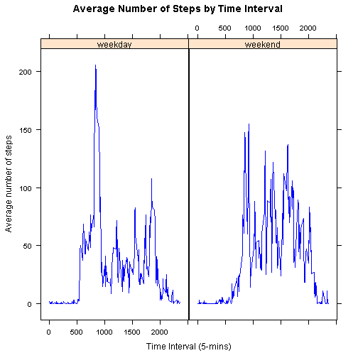

Assignment 1 - Human Activity Monitoring Report : Alok 
 
This assignment makes use of data from a personal activity monitoring device. This device collects data at 5 minute intervals through out the day. The data consists of two months of data from an anonymous individual collected during the months of October and November, 2012 and include the number of steps taken in 5 minute intervals each day.
Data
 
The data for this assignment can be downloaded from the course web site:
 
    Dataset: Activity monitoring data [52K] The variables included in this dataset are:
 
    steps: Number of steps taking in a 5-minute interval (missing values are coded as NA)
 
    date: The date on which the measurement was taken in YYYY-MM-DD format
 
    interval: Identifier for the 5-minute interval in which measurement was taken
 
The dataset is stored in a comma-separated-value (CSV) file and there are a total of 17,568 observations in this dataset.
Setting working directory for Assignment 1
 
Before running the program set your present working directory using setwd() to where file "activity.csv" is downloaded.To know your present working directory type getwd() in the console
Download and unzip the data
 
Before proceeding download the dataset: Activity monitoring data [52K] to your working directory and unzip as "activity.csv". You can also download using the script download.file() command in R.
 
Checking the availability of the data activity.csv".
 

```r
fname = "activity.csv"
zfname = "repdata-data-activity.zip"  # make sure this file is present in the working directory
if (!file.exists(fname)) {
    unzip(zfname)
}
```

#Loading and preprocessing the data
 
In this assignment package knitr and lattice would be used to create reports and analysis


```r
library(lattice)
library(knitr)
```

1. Load the data
 
Import the data using read.csv() and store into "acmData".

```r
HAMRDT <- read.csv("activity.csv", header = TRUE, colClasses = c("numeric", 
    "Date", "numeric"))
```

Note that I have used colClasses() to declare the variable types. Specifying a colClasses() argument to read.table or read.csv can save time on importing "big data". Make sure the number of arguments within colClasses() are exactly equal to number of columns in the data.
 
It is also good practice to print first few rows of the data to know some structure of the variables (columns). I would do that using the function head().
 

```r
head(HAMRDT)
```

```
##   steps       date interval
## 1    NA 2012-10-01        0
## 2    NA 2012-10-01        5
## 3    NA 2012-10-01       10
## 4    NA 2012-10-01       15
## 5    NA 2012-10-01       20
## 6    NA 2012-10-01       25
```

I want to know quick summary of the data loaded using summary() function.

```r
summary(HAMRDT)
```

```
##      steps            date               interval   
##  Min.   :  0.0   Min.   :2012-10-01   Min.   :   0  
##  1st Qu.:  0.0   1st Qu.:2012-10-16   1st Qu.: 589  
##  Median :  0.0   Median :2012-10-31   Median :1178  
##  Mean   : 37.4   Mean   :2012-10-31   Mean   :1178  
##  3rd Qu.: 12.0   3rd Qu.:2012-11-15   3rd Qu.:1766  
##  Max.   :806.0   Max.   :2012-11-30   Max.   :2355  
##  NA's   :2304
```

2. Data Processing
 
It is important to process/transform the data (if necessary) into a format suitable for analysis or make a tidy version of raw data. In R while reading raw data using read.xxxx(), by defult it would read variables as character unless we mention colClasses as an 'option' like I have done while reading the data using read.csv() [viz. colClasses=c("numeric", "Date","numeric") ]. Otherwise we would have convert the varibles into specific formats using as.date() or as.numeric() (e.g. HAMRDT$date<-as.Date(HAMRDT$date))
before performing any arithmetic operations.
 
Creation of new variable also integral part of data analysis, like here we would create some variables like minimum date, maximum date, total number of days to know the span of the Time Series.

```r
min_date <- min(HAMRDT$date)
max_date <- max(HAMRDT$date)
n_days <- as.numeric(max_date - min_date) + 1
```


We have time series data with a start date is 2012-10-01 and most recent date is 2012-11-30 over a span 61 days.

Data Analysis
I. What is mean total number of steps taken per day?
 
For this part of the assignment, we would ignore the missing values in the dataset. To do so we would essentially remove the missing rows or rows with value "NA" using the functon complete.cases(). This function produces a logical vector with 'TRUE's none of the 3 variables has a value "NA" in a particular row and'FALSE's otherwise.

```r
compl_HAMRDT <- HAMRDT[complete.cases(HAMRDT), ]  # data with only non-missing rows
num_compl_cases <- nrow(compl_HAMRDT)
```


# Missing data

```r
in_compl_HAMRDT <- HAMRDT[!complete.cases(HAMRDT), ]  ## data with only missing rows
num_incmpl_cases <- nrow(in_compl_HAMRDT)
```

There are 15264 rows with no missing observation and 2304  rows with NAs in the data.
 
#Problem Statement 1 : Make a histogram of the total number of steps taken each day
 
We would have to calculate total number of steps in a day using "steps" and "date". To do so we would use functions tapply() and sum() of "steps" group by "date". Alternatively, it can be done using library(sqldf) with a small query sqldf("select date, sum(steps) steps from compl_HAMRDT group by date order by date").
 
# Number of steps on a particular date

```r
stps_per_day <- as.data.frame(tapply(compl_HAMRDT$steps, INDEX = compl_HAMRDT$date, 
    FUN = "sum", na.rm = TRUE))
colnames(stps_per_day) <- "steps"
# maximum number of steps among all the dates + some buffer to label x-axis
max_num_steps <- max(stps_per_day) + 5000
```

# Plot histogram of frequency of the steps

```r
hist(stps_per_day$steps, main = "Total Number of Steps Per Day", xlab = "Total Number of Steps Per Day", 
    ylab = "Frequency", breaks = 10, xlim = c(0, max_num_steps), ylim = c(0, 
        20), col = "red")
```

  

plot of chunk unnamed-chunk-8

```r
# axis(side=1, at=axTicks(1, labels=formatC(axTicks(1),
# format='d',big.mark=','))
```

#Problem Statement 2 : Calculate and report the mean and median total number of steps taken per day
 
This can be done simply using the functions mean() and median().

```r
mean_num_steps <- format(mean(stps_per_day$steps, na.rm = TRUE), big.mark = ",", 
    scientific = F)
median_num_steps <- format(median(stps_per_day$steps, na.rm = TRUE), big.mark = ",", 
    scientific = F)
```

On an average 10,766 steps taken per day and with a meadian of 10,765 steps per day. Note that I have applied na.rm=TRUE to exclude missing values NA. I have also used format() to convert large numeric numbers separated with commas (",") to give a pretty look.
II. What is the average daily activity pattern?
 
#Problem statement 1 : Make a time series plot (i.e. type = "l") of the 5-minute interval (x-axis) and the average number of steps taken, averaged across all days (y-axis)
 
To plot average number of steps by time interval, we need to calculate mean of "steps" by "interval".
 
#Calculate average number of steps by intervals without missing values

```r
avg_no_stps_intvl <- as.data.frame(tapply(compl_HAMRDT$steps, INDEX = compl_HAMRDT$interval, 
    FUN = "mean", na.rm = TRUE))
# Name the calculated average column to avg_steps
colnames(avg_no_stps_intvl) <- "avg_steps"
```

#Name rownames to interval as INDEX has created unterval as rownames

```r
avg_no_stps_intvl$interval <- rownames(avg_no_stps_intvl)
row.names(avg_no_stps_intvl) <- NULL
```

Print few observations to check how the new summary data looks like.
 
#Check few observations from the top

```r
head(avg_no_stps_intvl)
```

```
##   avg_steps interval
## 1   1.71698        0
## 2   0.33962        5
## 3   0.13208       10
## 4   0.15094       15
## 5   0.07547       20
## 6   2.09434       25
```

 
 
Optional: quick summarization of the data
 
#summarization

```r
summary(avg_no_stps_intvl)
```

```
##    avg_steps        interval        
##  Min.   :  0.00   Length:288        
##  1st Qu.:  2.49   Class :character  
##  Median : 34.11   Mode  :character  
##  Mean   : 37.38                     
##  3rd Qu.: 52.83                     
##  Max.   :206.17
```

 
 
#Now plotting line graph of average number of steps against 5-miniute interval using plot() and with type="l" (for line graph).

```r
plot(avg_no_stps_intvl$interval, avg_no_stps_intvl$avg_steps, type = "l", xlab = "Time Interval (5-mins)", 
    ylab = "Average number of steps", main = "Average Number of Steps by Time  Interval", 
    col = "blue")
```

 

plot of chunk unnamed-chunk-13

```r
avg_no_stps_intvl_mx <- avg_no_stps_intvl[(avg_no_stps_intvl$avg_steps == max(avg_no_stps_intvl$avg_steps)), 
    ]
max_interval <- avg_no_stps_intvl_mx[1, 2]
```

We can see from the plot between 0 to 500 miniutes average number steps very close to 0 (zero) with a flat trend, between 500 to 835 miniutes there is a increasing trend and reached to a maximum of 206.1698 and sudden drop to below 50, for rest of the time periods oscilating between 0 to 100 steps.
 
#Problem statement 2 : Which 5-minute interval, on average across all the days in the dataset, contains the maximum number of steps?
 
Based on the above data analysis and trends we can see that the 5-miniutes interval with maximum number of average steps per day is 835.
III. Imputing missing values
 
Note that there are a number of days/intervals where there are missing values (coded as NA). The presence of missing days may introduce bias into some calculations or summaries of the data.
 
#Problem statement 1 : Calculate and report the total number of missing values in the dataset (i.e. the total number of rows with NAs)
 
# Missing data

```r
in_compl_HAMRDT <- HAMRDT[!complete.cases(HAMRDT), ]  ## data with only missing rows
num_incmpl_cases <- nrow(in_compl_HAMRDT)
```

Total Number of missing rows in the activity monitoring data is 2304.
 
#Problem statement 2 : Devise a strategy for filling in all of the missing values in the dataset. The strategy does not need to be sophisticated. For example, you could use the mean/median for that day, or the mean for that 5-minute interval, etc.
 
Missing value imputation can simply be done by the average steps per day, which we have calculated in the previous step. But let me use median as sometime median is a great representation of missing cases in the presence of extreme cases.
 
#Calculate median number of steps by intervals without missing values

```r
median_stps_intvl <- as.data.frame(tapply(compl_HAMRDT$steps, INDEX = compl_HAMRDT$interval, 
    FUN = "median", na.rm = TRUE))
# Name calculated median column to median_steps
colnames(median_stps_intvl) <- "median_steps"
# Name rownames to interval as INDEX has created unterval as rownames
median_stps_intvl$interval <- rownames(median_stps_intvl)
row.names(median_stps_intvl) <- NULL
mean_median <- merge(median_stps_intvl, avg_no_stps_intvl, by = "interval")
# merge mean and median with original data with missing
HAMRDT_with_summ <- merge(HAMRDT, mean_median, by = "interval")
```


```r
head(HAMRDT_with_summ)
```

```
##   interval steps       date median_steps avg_steps
## 1        0    NA 2012-10-01            0     1.717
## 2        0     0 2012-11-23            0     1.717
## 3        0     0 2012-10-28            0     1.717
## 4        0     0 2012-11-06            0     1.717
## 5        0     0 2012-11-24            0     1.717
## 6        0     0 2012-11-15            0     1.717
```

 

```r
tail(HAMRDT_with_summ)
```

```
##       interval steps       date median_steps avg_steps
## 17563     2355     0 2012-10-16            0     1.075
## 17564     2355     0 2012-10-07            0     1.075
## 17565     2355     0 2012-10-25            0     1.075
## 17566     2355     0 2012-11-03            0     1.075
## 17567     2355    NA 2012-10-08            0     1.075
## 17568     2355    NA 2012-11-30            0     1.075
```

 
 
Clearly, median would be better replacement than the average. Now to identify each of the missing cell and replace with median we have to apply loop on array.
 
#Problem statement 3 : Create a new dataset that is equal to the original dataset but with the missing data filled in.


The dataset "HAMRDT_No_Miss" is now would be filled by median. This data would be exactly the same as original data "HAMRDT" with no missing.

```r
for (i in (1:nrow(HAMRDT_with_summ))) {
    if (is.na(HAMRDT_with_summ$steps[i])) {
        HAMRDT_with_summ$steps[i] <- HAMRDT_with_summ$median_steps[i]
    }
}
```


```r
# head(HAMRDT_with_summ)
HAMRDT_No_Miss <- HAMRDT_with_summ[, c("steps", "date", "interval")]
# head(HAMRDT_No_Miss)
```

Compare summary with missing (NAs)


```r

summary(HAMRDT)
```

```
##      steps            date               interval   
##  Min.   :  0.0   Min.   :2012-10-01   Min.   :   0  
##  1st Qu.:  0.0   1st Qu.:2012-10-16   1st Qu.: 589  
##  Median :  0.0   Median :2012-10-31   Median :1178  
##  Mean   : 37.4   Mean   :2012-10-31   Mean   :1178  
##  3rd Qu.: 12.0   3rd Qu.:2012-11-15   3rd Qu.:1766  
##  Max.   :806.0   Max.   :2012-11-30   Max.   :2355  
##  NA's   :2304
```

 
Compare summary with out missing (No NAs)
 

```r
summary(HAMRDT_No_Miss)
```

```
##      steps          date               interval   
##  Min.   :  0   Min.   :2012-10-01   Min.   :   0  
##  1st Qu.:  0   1st Qu.:2012-10-16   1st Qu.: 589  
##  Median :  0   Median :2012-10-31   Median :1178  
##  Mean   : 33   Mean   :2012-10-31   Mean   :1178  
##  3rd Qu.:  8   3rd Qu.:2012-11-15   3rd Qu.:1766  
##  Max.   :806   Max.   :2012-11-30   Max.   :2355
```

 
 
Now there is no missing in the data. We can see the changes in the distribution after missing value imputation.
 
#Problem statement 4 : Make a histogram of the total number of steps taken each day and Calculate and report the mean and median total number of steps taken per day. Do these values differ from the estimates from the first part of the assignment? What is the impact of imputing missing data on the estimates of the total daily number of steps?
 
# Number of steps on a particular date

```r
stps_per_day_nm <- as.data.frame(tapply(HAMRDT_No_Miss$steps, INDEX = HAMRDT_No_Miss$date, 
    FUN = "sum"))
colnames(stps_per_day_nm) <- "steps"
# Maximum number of steps among all the dates + some buffer to label x-axis
max_num_steps <- max(stps_per_day_nm) + 5000
```

# Plot histogram of frequency of the steps

```r
hist(stps_per_day_nm$steps, main = "Total Number of Steps Per Day", xlab = "Total Number of Steps Per Day", 
    ylab = "Frequency", breaks = 10, xlim = c(0, max_num_steps), ylim = c(0, 
        20), col = "green")
```

 

plot of chunk unnamed-chunk-20
 
Clearly there is a change in the distribution of number of steps. Significantly for the initial days.
 
Calculate and report the mean and median total number of steps taken per day with missing values replaced by medians.

```r
mean_num_steps_nm <- format(mean(stps_per_day_nm$steps), big.mark = ",", scientific = F)
median_num_steps_nm <- format(median(stps_per_day_nm$steps), big.mark = ",", 
    scientific = F)
```

New Mean of the steps per day is 9,504 and the median of the steps per day is 10,395. compared to a average 10,766 steps taken per day and with a meadian of 10,765 steps per day after excluding missing values.
 
We can observe that both the mean and median decresed after missing value imputation.
IV. Are there differences in activity patterns between weekdays and weekends?
 
For this part the weekdays() function may be of some help here. Use the dataset with the filled-in missing values for this part.
 
#Problem statement 1 : Create a new factor variable in the dataset with two levels - "weekday" and "weekend" indicating whether a given date is a weekday or weekend day.
 
# Logical variable - weekdays: Saturday and Sunday would be TRUE else FALSE

```r
HAMRDT_No_Miss$weekdays <- grepl("^[Ss]", weekdays(as.Date(HAMRDT_No_Miss$date)))

for (i in (1:nrow(HAMRDT_No_Miss))) {
    if (HAMRDT_No_Miss$weekdays[i] == TRUE) {
        HAMRDT_No_Miss$week_day_factor[i] <- "weekend"
    } else {
        HAMRDT_No_Miss$week_day_factor[i] <- "weekday"
    }
}
```

#Check

```r
head(HAMRDT_No_Miss)
```

```
##   steps       date interval weekdays week_day_factor
## 1     0 2012-10-01        0    FALSE         weekday
## 2     0 2012-11-23        0    FALSE         weekday
## 3     0 2012-10-28        0     TRUE         weekend
## 4     0 2012-11-06        0    FALSE         weekday
## 5     0 2012-11-24        0     TRUE         weekend
## 6     0 2012-11-15        0    FALSE         weekday
```

 
#Problem statement 2 : Make a panel plot containing a time series plot (i.e. type = "l") of the 5-minute interval (x-axis) and the average number of steps taken, averaged across all weekday days or weekend days (y-axis). The plot should look something like the following, which was creating using simulated data:

```r
mean_stps_per_intvl_imput <- aggregate(HAMRDT_No_Miss$steps, by = list(HAMRDT_No_Miss$interval, 
    HAMRDT_No_Miss$week_day_factor), FUN = "mean", na.rm = TRUE)
colnames(mean_stps_per_intvl_imput) <- c("interval", "weekday", "avg_steps")

sort_order <- order(as.numeric(mean_stps_per_intvl_imput$interval))
mean_stps_per_intvl <- mean_stps_per_intvl_imput[sort_order, ]

mean_by_day_type <- aggregate(HAMRDT_No_Miss$steps, by = list(HAMRDT_No_Miss$week_day_factor), 
    FUN = "mean", na.rm = TRUE)
mean_weekdays <- round(mean_by_day_type[1, 2], 2)
mean_weekends <- round(mean_by_day_type[2, 2], 2)
```


```r
xyplot(data = mean_stps_per_intvl, avg_steps ~ as.numeric(interval) | as.factor(weekday), 
    type = "l", layout = c(1, 2), col = c("blue", "red"), main = "Average Number of Steps by Time Interval", 
    xlab = "Time Interval (5-mins)", ylab = "Average number of steps")
```

![plot of chunk unnamed-chunk-33] (graph/graph4.png) 

plot of chunk unnamed-chunk-25


```r
xyplot(data = mean_stps_per_intvl, avg_steps ~ as.numeric(interval) | as.factor(weekday), 
    type = "l", layout = c(2, 1), col = c("blue", "red"), main = "Average Number of Steps by Time Interval", 
    xlab = "Time Interval (5-mins)", ylab = "Average number of steps")
```

 

plot of chunk unnamed-chunk-25

More and more activities over weekend compare to week-days.
 
Note that the echo = TRUE parameter was added to the code chunk to print of the R codes that generate outputs in this report.
